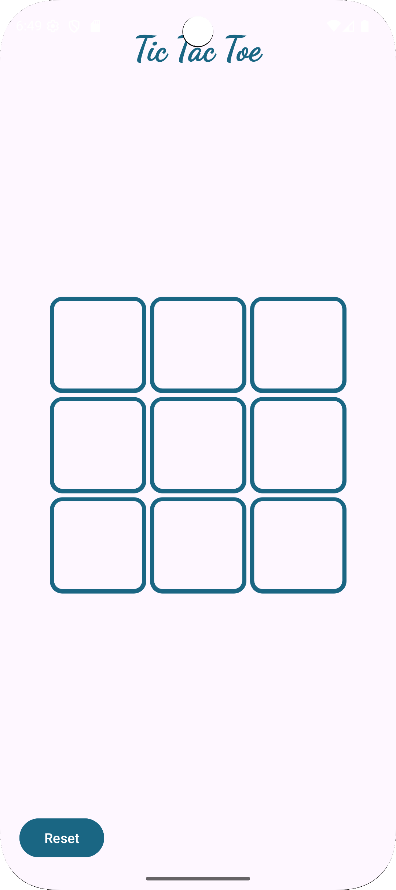

# Tic Tac Toe Game in Android (Kotlin)

A simple Tic Tac Toe game built using **Kotlin** in **Android Studio**. This project demonstrates the fundamentals of Android development including layout design, button interactions, game logic, and animation effects. This app allows two local players to play the classic game on a single device with win ,draw recognition and replay functionality.

##  Features

- Classic Tic Tac Toe gameplay (Player vs Player)
- 
- Interactive UI with responsive buttons
- automatically switches between 'X' AND 'O'
- Win detection logic
- Game reset functionality
- Bounce animation effect for buttons

## Project Structure
 
- Layout design using XML  
-  Handling button clicks (`onButtonClick()` function)  
-  Win condition logic implementation (`win()` function)  
- Disabling buttons after game ends and resetting the game  
-  Adding bounce animation & correcting logic bugs

## Requirements

- Android Studio 
- Kotlin 
- Basic knowledge of Android development
 
## how to run 
1. clone the repository
2. open the project in android studio.
3. let gradle sync and build the project.
4. run the app in the emulator

---
